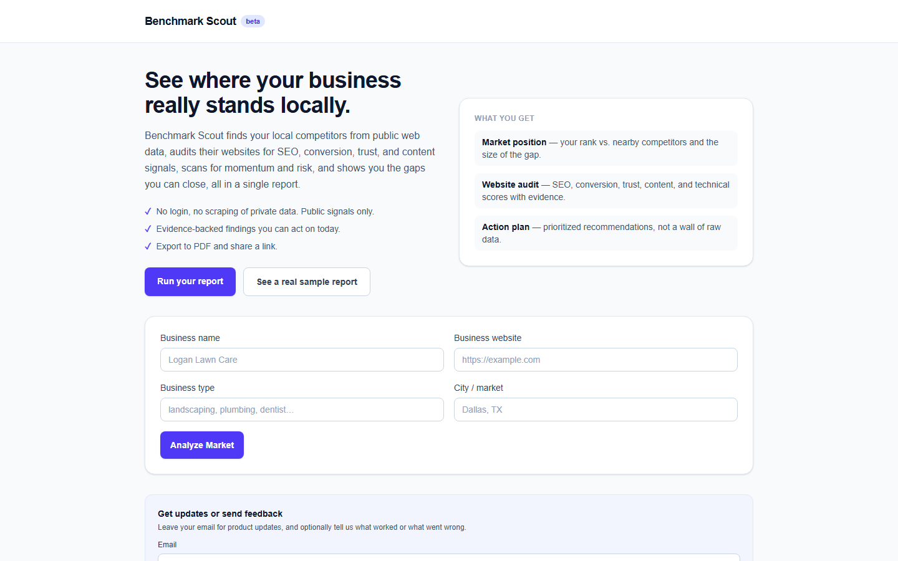
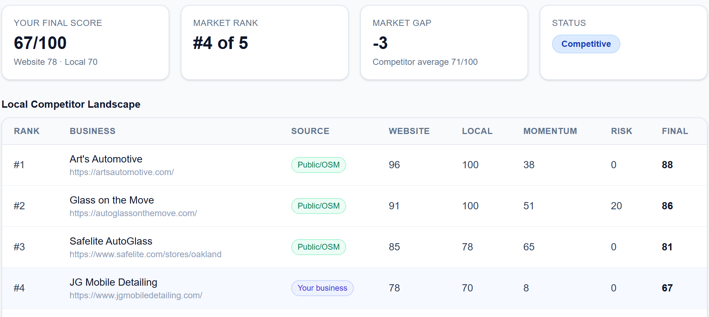

<div align="center">

<picture>
  <source media="(prefers-color-scheme: dark)" srcset=".github/assets/logo-dark.svg">
  
</picture>

<p><strong>Local competitor intelligence, built entirely from public web signals.</strong></p>

[](https://benchmark-scout.vercel.app)
[](https://github.com/loganlewisw1112-create/Benchmarket-Scout-_-scraper-tool/actions/workflows/ci.yml)


<a href="https://benchmark-scout.vercel.app"><strong>benchmark-scout.vercel.app&nbsp;→</strong></a>

</div>

<p align="center">
  <a href="https://benchmark-scout.vercel.app">
    
  </a>
</p>

Give it a business, a type, and a city. It finds the real competitors nearby,
audits their public websites, pulls public news mentions, scores what it can
actually verify, and writes up a source-backed report you can read on screen,
share by link, or export to PDF.

The one rule the whole thing is built around: **it never makes a number up.**
Every figure traces back to something it actually fetched. When the evidence
isn't there, it says so instead of guessing.

## How it works

The analysis runs as a pipeline, one stage feeding the next:

1. **Geocode** the market with Nominatim to get a real bounding box.
2. **Discover** nearby businesses of the same type from OpenStreetMap via
   Overpass.
3. **Audit** each one's public website directly — structure, signals, linked
   public pages — no paid data brokers in the loop.
4. **Score** only the businesses whose sites actually audited. Anything it
   couldn't verify stays visible but unranked.
5. **Write** the report from those scores: findings, risks, a ranked
   comparison, and recommendations, each tied to a source ID.

<p align="center">
  
</p>
<p align="center"><sub>A slice of a real report — your score, your rank, and the ranked competitor landscape, every row sourced from public OSM data.</sub></p>

## The real-data rule

This is the part that makes the tool worth trusting, so it's enforced in code,
not just intended.

Every production report carries `schemaVersion: 2`,
`provenance.policy: "real-only"`, `containsSyntheticData: false`, and a full
Sources Appendix. A prebuild gate (`npm run check:real-data-only`) fails the
build if any demo or mock path can reach production.

When evidence is missing or unreachable, the value is `null` and renders as
`N/A` — it's never backfilled with an estimate. A discovered business whose
site won't audit stays in the list but sits out the rankings. And if a request
turns up no usable real evidence at all, the API returns
`422 INSUFFICIENT_REAL_DATA` and saves nothing. An empty answer is the honest
answer.

Report prose is generated from templates driven by the computed scores and
signals — **no LLM writes report content.** Findings are directional
observations about public signals, labeled with a confidence level, not claims
about a company's internal reality.

## Where the data comes from

- **Nominatim** — geocoding the market.
- **Overpass / OpenStreetMap** — discovering local competitors.
- **Public websites** — fetched directly for the audit, no third-party APIs.
- **GDELT and linked public articles** — public news mentions.

And, deliberately, nowhere else. No paid APIs, no accounts, and nothing from
Google Places, Yelp, SerpApi, LinkedIn, Instagram, TikTok, or X. Social
profiles show up only when a public page links to them.

Map data © OpenStreetMap contributors, under the Open Database License. The
site footer, the PDF export, and every report's Sources Appendix carry that
attribution with a link to <https://www.openstreetmap.org/copyright>.

## Data freshness and caching

The public map services are free and often slow, so some answers are reused.
Every reuse keeps its real date:

| What | Reused for |
|---|---|
| Geocoded market (Nominatim) | 30 days |
| Competitor search (Overpass) | 72 hours; up to 14 days only if every live Overpass instance fails |
| robots.txt | 24 hours |
| Full analysis | 6 hours |
| Homepage audits | 12 hours, per server instance only |

- With the KV store configured, everything except homepage audits is cached
  there under `cache:v1:<bucket>:<sha256>` keys that expire on their own, so
  every instance shares it. Without KV, the same windows apply to a local
  file cache under `CACHE_DIR`. A cache error falls back to a live fetch; it
  never fails a request.
- Each source in the Sources Appendix shows when it was actually fetched,
  not when the report was built. A cached analysis keeps its original
  `generatedAt` and is flagged `cacheHit`.
- A cached competitor list is disclosed in the report's notes ("Competitor
  list from OpenStreetMap as retrieved on <date>"). The cache key is the
  exact Overpass query, so a different radius, center, or category never
  reuses another search. With no usable copy and no live answer, the
  analysis stops with `503 SOURCE_UNAVAILABLE`.
- Overpass is asked at overpass-api.de, then overpass.private.coffee, then
  maps.mail.ru. If none has answered after 7 s, the next one starts in
  parallel (up to three at once), and a failed instance is replaced
  immediately, all within a 24 s discovery budget. Queries allow 25 s on the
  server.

## Run it locally

```bash
npm install
npm run dev
# http://localhost:3000
```

Set a real contact address in your user agent before hitting the public
services:

```bash
APP_USER_AGENT="BenchmarkScout/0.1 (contact: you@yourdomain.com)"
```

> Don't leave `example.com` in there. Nominatim's and Overpass's edge networks
> block any request whose User-Agent contains `example.com` — it's the classic
> unconfigured-scraper tell, so their WAFs reject it outright with an unhelpful
> 403/406. Use an address you actually own.

Other environment variables you may want locally:

```bash
CACHE_DIR=".cache"        # file cache, used when no KV store is configured
STRICT_ROBOTS=false       # when true, every audit fetch checks robots.txt first
MAINTENANCE_MODE=false    # when true, disables analysis but keeps /api/health up
```

`.env.example` lists the rest, including `NEXT_PUBLIC_SITE_URL` (the canonical
origin) and `ALLOW_PREVIEW_KV` (see [DEPLOY.md](./DEPLOY.md)).

## Tests and checks

```bash
npm run lint                  # eslint
npx tsc --noEmit              # typecheck
npm test                      # vitest — offline and deterministic, no network
npm run test:coverage         # same suite with a v8 coverage report
npm run check:real-data-only  # reject demo/mock paths reaching production
npm run build                 # production build, warning-free
```

The vitest suite runs entirely offline: SSRF guards, input validation, scoring,
discovery, robots parsing, rate limiting, provenance, storage, and route
behavior. CI (`.github/workflows/ci.yml`) runs lint, typecheck, test, and build
on every push and pull request.

## Deployment

The hosted build runs on Vercel with an Upstash (Vercel KV) store behind it, live in
open beta at **[benchmark-scout.vercel.app](https://benchmark-scout.vercel.app)**. It
needs the KV store plus a few environment variables — `KV_REST_API_URL` /
`KV_REST_API_TOKEN`, an optional `SCOUT_API_KEY`, and `MAINTENANCE_MODE` (a clean
holding state that keeps `/api/health` up while pausing analysis). The full list and
the launch/rollback steps are in [DEPLOY.md](./DEPLOY.md).

The API surface is small:

| Endpoint | What it does | Per-IP limit (per minute) |
|---|---|---|
| `POST /api/analyze-market` | Runs the pipeline. Also capped at 30 analyses a minute across all clients. | 10 |
| `GET /api/sample-report` | Returns a saved real sample report. | 30 |
| `POST /api/waitlist` | Email signup and feedback. Also capped at 10 new signups a minute overall. | 5 |
| `GET /api/reports/[id]`, `GET /r/[id]` | Read a saved report as JSON or as a shareable page. | 60 |
| `POST /api/sample-report/refresh` | Operator-only sample refresh (secret header). | 10 failed attempts |
| `GET /api/health` | Health of the served sample pool and the store. | none |

Each limit is its own bucket, so heavy report reading never eats into a
client's analysis budget. Limits are counted in KV; if KV is unreachable they
fall back to a per-instance in-memory counter, which is weaker because each
serverless instance counts on its own.

The two JSON POST endpoints (analyze and waitlist) accept only
`Content-Type: application/json` from the same site: anything else gets
`415 UNSUPPORTED_MEDIA_TYPE`, and a cross-site `Origin` or
`Sec-Fetch-Site: cross-site` gets `403 CROSS_SITE_REQUEST`. The optional
access code goes in the `x-scout-key` header only; the old `?key=` query
parameter is gone.

`/api/health` answers `200` with `status: "ok"` when at least 10 samples are
fresher than 72 hours and the durable store is reachable. It answers `503`
with `status: "degraded"` and the reasons in `alertReasons`
(`ACTIVE_SAMPLES_LOW`, `SERVED_SAMPLES_STALE`, `DURABLE_STORE_UNAVAILABLE`)
when any of those fail, so a plain HTTP monitor sees the problem. The ages it
reports are for the samples actually being served, not the whole catalog.
During maintenance it answers `200` with `maintenance: true`. A `200` may be
cached at the edge for 30 seconds; a `503` never is.

### Error responses

Every API error has the same body: `{ "code": "SCREAMING_SNAKE", "error": "human message" }`,
sometimes with extra fields such as `retryable` or `details`. The UI picks its
message from `code`, so treat `code` as the contract and `error` as display
text.

| Status | Codes |
|---|---|
| 400 | `INVALID_REQUEST` |
| 401 | `ACCESS_CODE_REQUIRED` |
| 403 | `CROSS_SITE_REQUEST` |
| 404 | `REPORT_NOT_FOUND`, `NOT_FOUND` (unknown `/api/*` path) |
| 405 | `METHOD_NOT_ALLOWED` |
| 410 | `LEGACY_REPORT_UNAVAILABLE` |
| 415 | `UNSUPPORTED_MEDIA_TYPE` |
| 422 | `AMBIGUOUS_MARKET`, `MARKET_NOT_FOUND`, `INDUSTRY_NOT_RESOLVED`, `NO_COMPETITORS_FOUND`, `USER_SITE_UNAVAILABLE`, `INSUFFICIENT_REAL_DATA` |
| 429 | `RATE_LIMITED` (with `Retry-After`) |
| 500 | `INTERNAL_ERROR`, `REAL_DATA_INVARIANT_FAILED` (a report failed the provenance check and was not saved) |
| 503 | `SOURCE_UNAVAILABLE` (retry later), `STORAGE_UNAVAILABLE`, `REAL_SAMPLE_UNAVAILABLE`, `MAINTENANCE` |
| 504 | `ANALYSIS_TIMEOUT` (retry later) |

The operator-only refresh route adds `UNAUTHORIZED` (401), `UNKNOWN_CATALOG_ID`
(400), `SAMPLE_QUALITY_GATE_FAILED` (422), and `SAMPLE_REFRESH_NOT_CONFIGURED`
(503).

All the 422s from the analysis endpoint mean the same thing: there wasn't enough real evidence for an
honest report, so nothing was saved.

## Project layout

`app/` holds the dashboard, the shareable report page (`r/[id]`), and the API routes
(analyze, reports, samples, waitlist, health). `lib/` is the pipeline itself —
geocoding, discovery, auditing, signals, scoring, report + PDF generation, rate
limiting, robots.txt, storage, and logging. `components/` is the UI with co-located
tests, and `scripts/` is operator tooling.

PDF export runs client-side (`jsPDF`) from the on-screen report — no second backend
call. The PDF code only downloads when someone clicks the button. Names outside
the basic Latin set are drawn with an embedded Noto Sans font (SIL OFL, in
`public/fonts/`, fetched only when needed); any character that font can't draw
either (CJK, for example) prints as `?` and the PDF says so, rather than
garbling the line. Server logs are single-line JSON, each analyze response tagged with an
`x-request-id` that's propagated through AsyncLocalStorage and repeated on every log
line for that request.

## Safety

- **No bypassing anything.** No private pages, no login/paywall/CAPTCHA
  bypass — only what's publicly reachable.
- **SSRF protection** (`lib/url-safety.ts`) blocks fetches to localhost,
  private IP ranges (`10/8`, `172.16/12`, `192.168/16`), link-local addresses
  (including the `169.254.169.254` cloud-metadata endpoint), and the IPv6
  equivalents. It re-checks resolved DNS, not just the hostname, and caps and
  re-validates redirects.
- **robots.txt** (`lib/robots.ts`, opt-in via `STRICT_ROBOTS=true`): every
  audit fetch — homepages, linked pages, each redirect hop — first checks the
  site's robots.txt, honoring user-agent groups (exact `BenchmarkScout` token,
  repeated groups merged), longest-match `Allow`/`Disallow`, `*` wildcards, and
  `$` anchors. Results cache for up to 24h: in KV when it is configured,
  shared by every instance, otherwise in a per-instance file cache that a
  cold start clears.
  A missing (4xx), unreachable, or malformed file fails open so audits keep
  working. A 5xx answer is treated as a full disallow for that lookup
  (RFC 9309) and is not cached.
- **Security headers** (`next.config.ts`) on every route: a Content Security
  Policy locked to this origin (`frame-ancestors 'none'`), `X-Frame-Options:
  DENY`, `X-Content-Type-Options: nosniff`, `Referrer-Policy:
  strict-origin-when-cross-origin`, and a minimal `Permissions-Policy`.
  `X-Powered-By` is off.

## Known limits

- Free OSM data doesn't reliably carry ratings or reviews.
- Public data is often sparse, stale, or incomplete; unavailable values stay
  unscored and show as `N/A`.
- Findings are public signals, not verified internal business facts.
- Social platforms are never scraped behind logins — only publicly linked
  profiles surface.
- Old reports without valid v2 real-only provenance are intentionally
  unreadable and return `410 LEGACY_REPORT_UNAVAILABLE`.

## Working on it

Stack: Next.js 16, React 19, TypeScript, Tailwind CSS 4, Zod, Vitest. Node 24
(`engines` pins `24.x`, matching Vercel and CI).

Heads up for contributors: this repo runs Next 16, which changed enough that
habits from older versions will bite you. See [AGENTS.md](./AGENTS.md) — read
the relevant guide under `node_modules/next/dist/docs/` before writing app code.

## License

Proprietary — all rights reserved. This is **not** open source; no permission
is granted to use, copy, publish, distribute, or sell it. See [LICENSE](./LICENSE).
